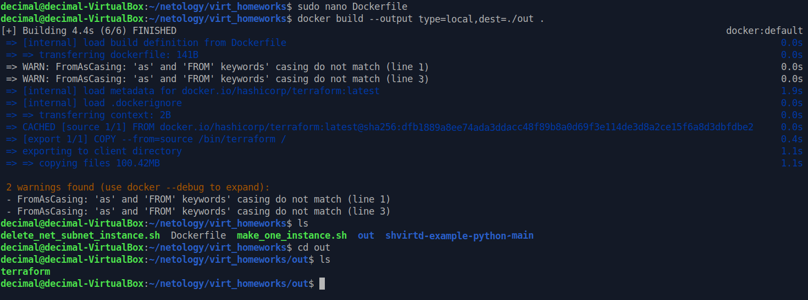

# Домашка по заданию 5

## Задача 0
 - docker-compose не установлен, docker compose установлен:  


## Задача 1
fork: https://github.com/decimal-kmn/shvirtd-example-python.git 

**управление названием таблицы через ENV переменную:**
- добавляем в код: db_table = os.environ.get('DB_TABLE', 'requests')
- и заменяем хардкод requests на {db_table}
- Потестить не успел, но должно работать

## Задача 2
результат сканирования error, в консоли пишет, что "Неподдерживаемая операционная система debian:13":  


результат скана trivy в файле [trivy-scan.sarif](./misc/trivy-scan.sarif)

## Задача 3
sql query:  


## Задача 4
 
bash script:
[start_script.sh](start_script.sh)

check-http:  

remote ssh context:  

SQL query:  
  
fork: https://github.com/decimal-kmn/shvirtd-example-python.git

## Задача 5 
Должно быть что-то вроде этого:  
```bash
docker run --rm \
    --network "$NETWORK" \
    -e "MYSQL_HOST=$MYSQL_HOST" \
    -e "MYSQL_USER=$MYSQL_USER" \
    -e "MYSQL_PASSWORD=$MYSQL_PASSWORD" \
    -e "MYSQL_DATABASE=$MYSQL_DATABASE" \
    -v "$BACKUP_DIR:/backup" \
    schnitzel/mysqldump  
```
Но почему-то виснет.  

В крон засунуть:  

```bash
     crontab -e 
```
Туда строку:
```bash
* * * * * ~/scripts/backup.sh >/dev/null 2>&1
```

## Задача 6
```bash
docker pull hashicorp.teeraform:latest
docker save hashicorp.teeraform:latest -o terraform.tar
dive terraform.tar
```
 просто смотрим где лежит бинарник:  


Потом, распаковываем архив, пробегаемся по нему, ищем слойв котором бинарник.  


рапаковываем слой.   


забираем бинарь.  


6.1 через docker cp:
    делаем временный контейнер из hashicorp.teeraform:latest, затем: 

```bash
    docker cp temp_terraform:/bin/terraform ./terraform
```
./terraform - тут будет бинарь  


6.2 через docker build и dockerfile:
делаем такой докерфайл:
```bash
    FROM hashicorp/terraform:latest AS source

    FROM scratch AS export # scatch - пустой образ
    COPY --from=source /bin/terraform /
```
Потом команду:

    docker build --output type=local,dest=./out .



## Задача 7
1. ставим sudo apt-get install -y runc python3 (и debootstrap, им сделаем базовую среду на минималках )  
 
2. Делаем директорию: например, rootfs
3. делаем в папку sudo debootstrap --variant=minbase focal ~/runc-netology/rootfs http://archive.ubuntu.com/ubuntu/:  
 
4. теперь делаем замечательный chroot ~/runc-netology/rootfs /bin/bash, и мы как бы рут и уже внутри rootfs ставим python3, потом выходим:  
 
5. теперь runc spec и получаем базовый конфиг json:  
   
6.  В нем в process нужно args поменять:  
 
7. А питоновский hello.py мы заранее сделали:  
    
8. и запускаем: sudo runc run hello-python (hello-python это просто имя контейнера, сами придумали):  
    

